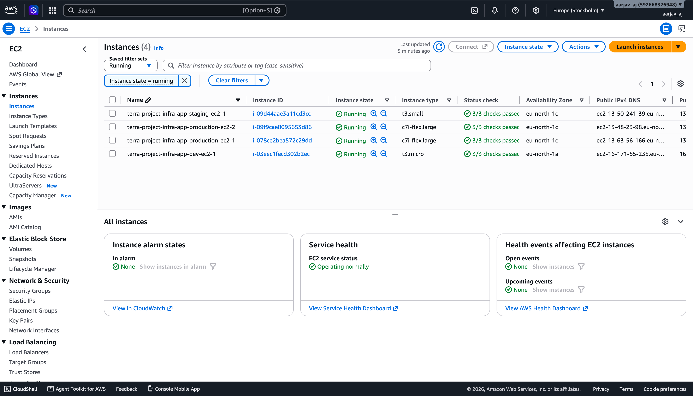
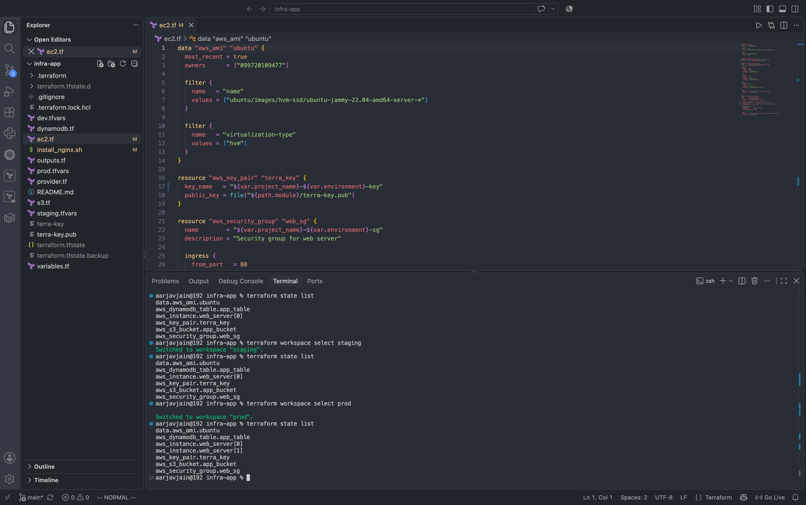
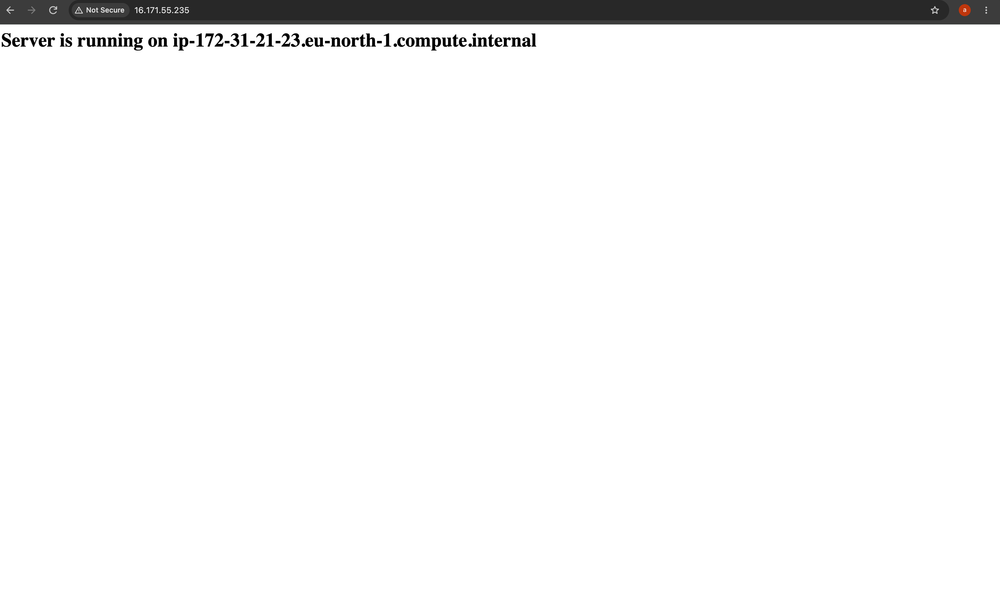
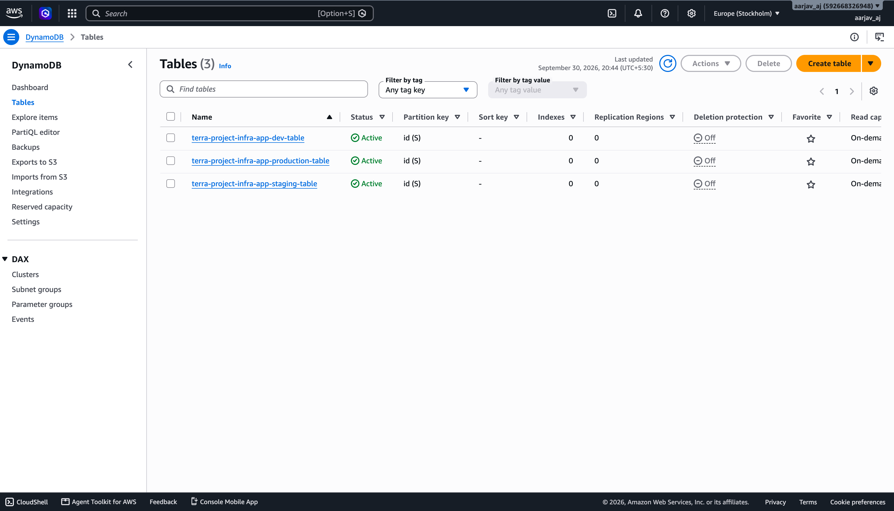
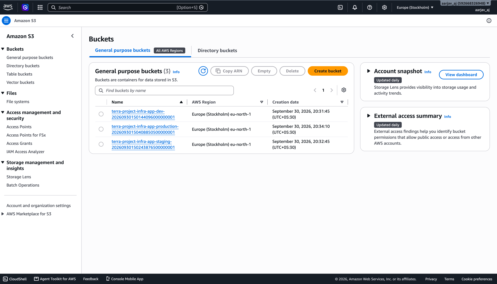

# AWS Infrastructure Automation with Terraform

Terraform configurations to provision isolated AWS infrastructure for Development, Staging, and Production environments using Terraform Workspaces.

## Architecture

- **Compute**: EC2 instances running Ubuntu 22.04 LTS, key pair (`terra-key`), and automated Nginx installation via user data.
- **Storage**: S3 bucket per environment with prefix-based naming.
- **Database**: DynamoDB table with on-demand (`PAY_PER_REQUEST`) billing.
- **Security**: Security group allowing inbound HTTP (port 80) and SSH (port 22).
- **State Management**: Terraform Workspaces for complete state isolation across environments.

## Environment Specifications

| Environment | Workspace | Variable File | Instances | Instance Type | Root Volume | S3 Bucket | DynamoDB Table |
|---|---|---|---|---|---|---|---|
| Development | `dev` | `dev.tfvars` | 1 | t3.micro | 20 GB (gp3) | Yes | Yes |
| Staging | `staging` | `staging.tfvars` | 1 | t3.small | 15 GB (gp3) | Yes | Yes |
| Production | `prod` | `prod.tfvars` | 2 | c7i-flex.large | 30 GB (gp3) | Yes | Yes |

## Project Structure

```text
infra-app/
├── provider.tf          # Provider setup (AWS)
├── variables.tf         # Variable declarations
├── ec2.tf               # EC2, Key Pair, and Security Group resources
├── s3.tf                # S3 bucket resource
├── dynamodb.tf          # DynamoDB table resource
├── outputs.tf           # Output values
├── install_nginx.sh     # User data startup script (Nginx auto-install)
├── dev.tfvars           # Development environment variables
├── staging.tfvars       # Staging environment variables
├── prod.tfvars          # Production environment variables
└── assets/              # Infrastructure verification screenshots
```

## Deployment Instructions (Running All 3 Environments Concurrently)

Terraform Workspaces isolate state files, allowing all three environments (**Dev**, **Staging**, and **Production**) to run simultaneously on AWS without interfering with each other.

### 1. Initialize Project
```bash
terraform init
```

### 2. Deploy All Environments Concurrently

Run the following commands sequentially. Each workspace creates and manages its own infrastructure independently, keeping all environments active side-by-side:

```bash
# 1. Deploy Dev Environment (1x t3.micro | 20GB gp3)
terraform workspace new dev || terraform workspace select dev
terraform apply -var-file="dev.tfvars" -auto-approve

# 2. Deploy Staging Environment (1x t3.small | 15GB gp3) — Dev remains live
terraform workspace new staging || terraform workspace select staging
terraform apply -var-file="staging.tfvars" -auto-approve

# 3. Deploy Production Environment (2x c7i-flex.large | 30GB gp3) — Dev & Staging remain live
terraform workspace new prod || terraform workspace select prod
terraform apply -var-file="prod.tfvars" -auto-approve
```

### 3. Verify Active Environments & State Isolation
Verify that all 3 workspaces and their independent resources are running concurrently:
```bash
# List all active workspaces
terraform workspace list

# View resources for each environment
terraform workspace select dev && terraform state list
terraform workspace select staging && terraform state list
terraform workspace select prod && terraform state list
```

### 4. SSH Access
Connect to any active EC2 instance using the `terra-key` private key:
```bash
ssh -i terra-key ubuntu@<ec2-public-ip>
```

### 5. Teardown / Cleanup
To destroy all environments when testing is complete:
```bash
# Destroy Dev
terraform workspace select dev && terraform destroy -var-file="dev.tfvars" -auto-approve

# Destroy Staging
terraform workspace select staging && terraform destroy -var-file="staging.tfvars" -auto-approve

# Destroy Production
terraform workspace select prod && terraform destroy -var-file="prod.tfvars" -auto-approve
```

---

## Infrastructure Verification

### 1. AWS EC2 Management Console
All 4 instances running simultaneously across dev, staging, and production environments with proper tags, instance types, and health checks:



### 2. Terraform Workspaces State Isolation
Managing independent state for dev, staging, and prod using Terraform Workspaces:



### 3. Automated Nginx Web Server
Automated bootstrapping via user data script running on live public IP:



### 4. AWS S3 Buckets
Isolated general-purpose buckets created for each environment:



### 5. AWS DynamoDB Tables
On-demand DynamoDB tables provisioned per environment:


